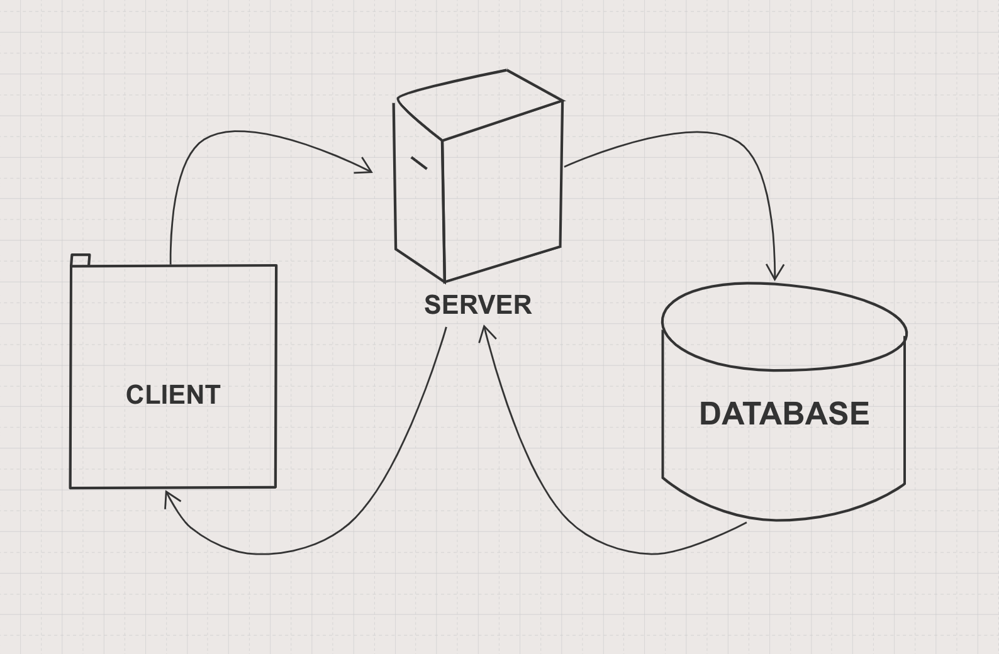

USER STORIES:

As a user,
I want to see a list of bookmarks
So that I am able to know what I need to look at today.

SQL INSTRUCTIONS:

  Bookmark Manager Database:

  1. Connect to psql

  2. Create the database using the psql command CREATE DATABASE bookmark_manager;

  3. Connect to the database using the pqsl command \c bookmark_manager;

  4. Run the query we have saved in the file 01_create_bookmarks_table.sql

  Bookmark Manager Testing Database:

  1. Connect to psql

  2. Create the database using the psql command CREATE DATABASE bookmark_manager_test;

  3. Connect to the database using the pqsl command \c bookmark_manager_test;

  4. Run the query we have saved in the file 01_create_bookmarks_table.sql

